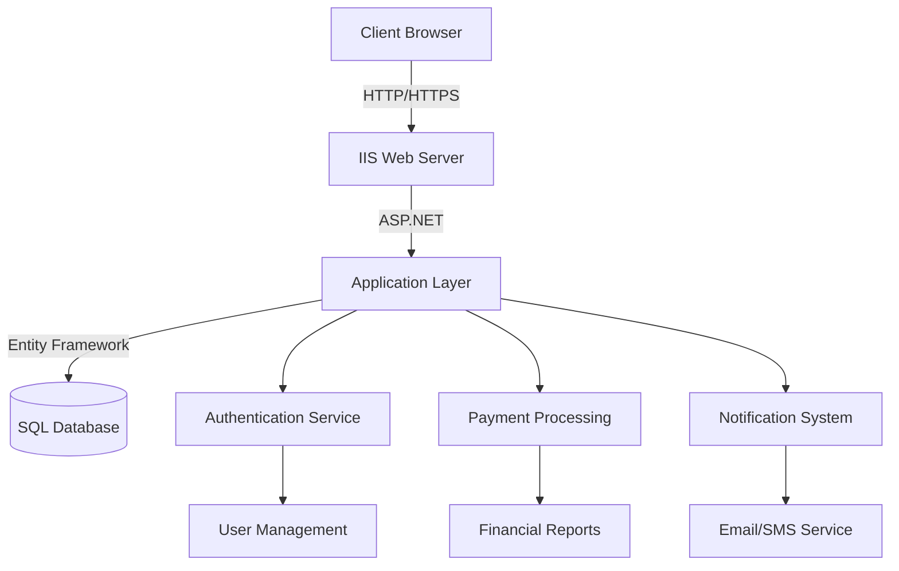
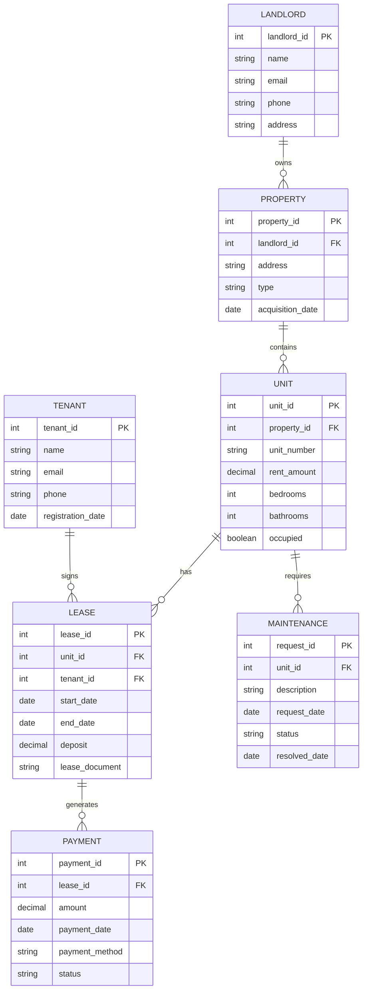

# Nyumbani-Landlords 🏠

> *"Nyumbani"* is a Swahili word that translates to "home".

A comprehensive digital property management solution designed to solve the challenges faced by landlords and tenants during property tenure.


## 📋 About

Nyumbani Property Manager is a powerful system that enables you to manage your properties digitally with ease and efficiency. We aim to create an ecosystem that brings:

- **🔍 Transparency**: Clear communication and documentation between all parties
- **🔒 Safety**: Secure handling of tenant information and payment processing
- **✨ Convenience**: Streamlined workflows for property management tasks

Our mission is to bridge the gap between different types of communities and residencies while simplifying the onboarding process for both landlords and tenants.

## ✅ Key Features

- **📝 Digital Lease Management**: Create, sign, and store leases electronically
- **💰 Automated Rent Collection**: Set up recurring payments and track income
- **🔧 Maintenance Request Tracking**: Streamline repair requests and scheduling
- **👥 Tenant Screening**: Verify potential tenants with integrated background checks
- **📊 Financial Reporting**: Generate detailed income and expense reports
- **💬 Communication Hub**: Centralized messaging system for landlords and tenants

## 🖥️ What's in Store


## 🚀 Project Structure

```
Nyumbani-Landlords/
├── assets/              # Stylings, fonts, and theme resources
│   ├── css/             # Stylesheet files
│   ├── fonts/           # Custom fonts
│   └── img/             # Image resources
├── js/                  # JavaScript libraries and modules
├── plugins/             # Third-party plugins and extensions
│   ├── bootstrap-table/ # Bootstrap table components
│   ├── chart.js/        # Chart visualization library
│   └── datepicker/      # Date selection component
├── scripts/             # Common application scripts
└── web.config           # SQL connection and web configurations
```

## 🏗️ System Architecture



## 🗄️ Database Schema



## 💻 Code Snippets

### Connection String Setup

```xml
<!-- web.config -->
<connectionStrings>
  <add name="NyumbaniContext" 
       connectionString="Data Source=YOUR_SERVER;Initial Catalog=NyumbaniDB;Integrated Security=True" 
       providerName="System.Data.SqlClient" />
</connectionStrings>
```

### Tenant Registration Logic

```csharp
// TenantController.cs
[HttpPost]
public ActionResult Register(TenantViewModel model)
{
    if (ModelState.IsValid)
    {
        var tenant = new Tenant
        {
            Name = model.Name,
            Email = model.Email,
            Phone = model.Phone,
            RegistrationDate = DateTime.Now
        };
        
        db.Tenants.Add(tenant);
        db.SaveChanges();
        
        // Send welcome email
        EmailService.SendWelcomeEmail(tenant.Email, tenant.Name);
        
        return RedirectToAction("Dashboard", "Home");
    }
    
    return View(model);
}
```

### Rent Payment Processing

```javascript
// payment.js
function processPayment(leaseId, amount) {
    $.ajax({
        url: '/api/payments/process',
        type: 'POST',
        data: JSON.stringify({
            leaseId: leaseId,
            amount: amount,
            paymentMethod: $('#paymentMethod').val(),
            paymentDate: new Date()
        }),
        contentType: 'application/json',
        success: function(response) {
            showNotification('Payment processed successfully', 'success');
            updatePaymentHistory(leaseId);
        },
        error: function(xhr) {
            showNotification('Payment processing failed: ' + xhr.responseText, 'error');
        }
    });
}
```

## 🔧 Technical Stack

- **Frontend**: 
  - HTML5, CSS3, JavaScript
  - Bootstrap 4
  - jQuery
  - Chart.js for visualizations
  
- **Backend**: 
  - ASP.NET MVC
  - C# 
  - Entity Framework
  
- **Database**: 
  - SQL Server
  
- **Hosting**: 
  - IIS on Windows Server

## 📦 Installation

```bash
# Clone the repository
git clone https://github.com/Kuria-byte/Nyumbani-Landlords.git

# Navigate to the project directory
cd Nyumbani-Landlords

# Configure web.config with your database connection

# Set up the database
Update-Database -Verbose

# Run the application through Visual Studio or IIS
```

## 🚀 Deployment

- Currently under development
- Will support deployment to Azure and on-premises IIS servers
- Docker container support planned for future releases

## 👥 Contributing

We welcome contributions to the Nyumbani-Landlords project. Please feel free to submit pull requests or open issues to suggest improvements.

1. Fork the repository
2. Create your feature branch (`git checkout -b feature/amazing-feature`)
3. Commit your changes (`git commit -m 'Add some amazing feature'`)
4. Push to the branch (`git push origin feature/amazing-feature`)
5. Open a Pull Request

## 📄 License

This project is licensed under the MIT License - see the LICENSE file for details.

## 📞 Contact

- **Project Maintainer**: [Kuria-byte](https://github.com/Kuria-byte)
- **Website**: [Ian Kuria - Software Architect](www.kuria.pro)
- **Email**: [Contact Email](ianmwitumi@gmail.com)

---

⭐ Star this repo if you find it useful! ⭐
